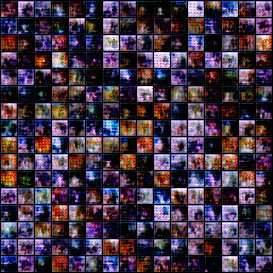

# ArtBench-10 trial on Spark

[](README.md)

これは、`Spark`分散計算フレームワークを使用した`ArtBench-10`([32x32 CIFAR-python](https://artbench.eecs.berkeley.edu/files/artbench-10-python.tar.gz))データセットに基づく1つの拡張性のテストです。試験では、畳み込み生成対抗ネットワーク(`CGAN.py`を参照)を訓練した。ノートブック`test_after_training_CGAN.ipynb`は生成効果をテストした。

## 原始論文:
Liao, P., Li, X., Liu, X., & Keutzer, K. (2022). The ArtBench Dataset: Benchmarking Generative Models with Artworks. [ArXiv, abs/2206.11404](https://arxiv.org/abs/2206.11404).

## 元のリポジトリ:
[https://github.com/liaopeiyuan/artbench](https://github.com/liaopeiyuan/artbench)

## CGAN.py の用法
```bash
spark-submit CGAN.py \
# カスタムリソース割り当て,たとえば、
--master <your Spark standalone url> \
--total-executor-cores 4 \
--executor-cores 1 \
--executor-memory 2G \
--driver-memory 4G \
```

## test_after_training_CGAN.ipynb の用法:
ノート内のセルを実行する。以下に事例図を示す:


##
ここに原作者への心からの感謝を申し上げます。